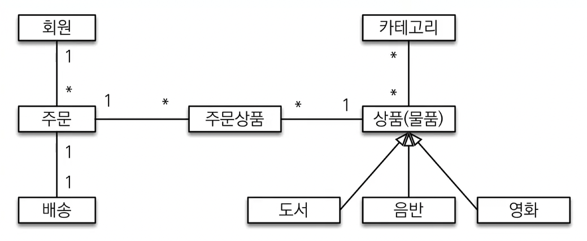
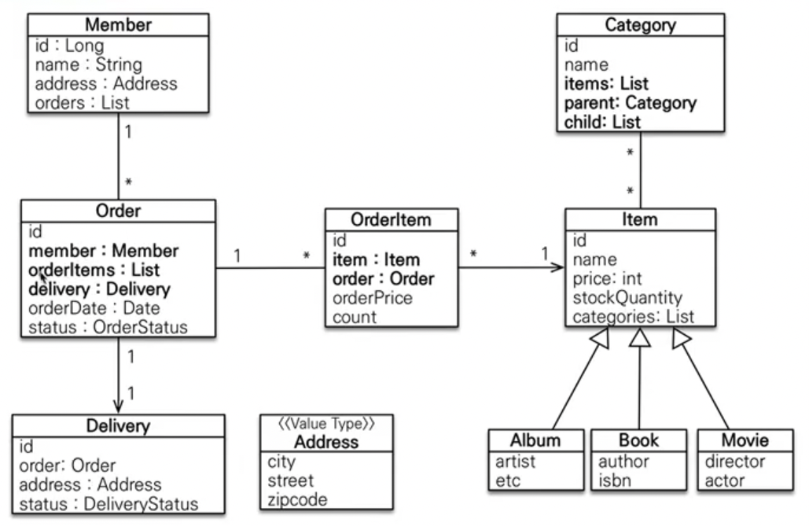
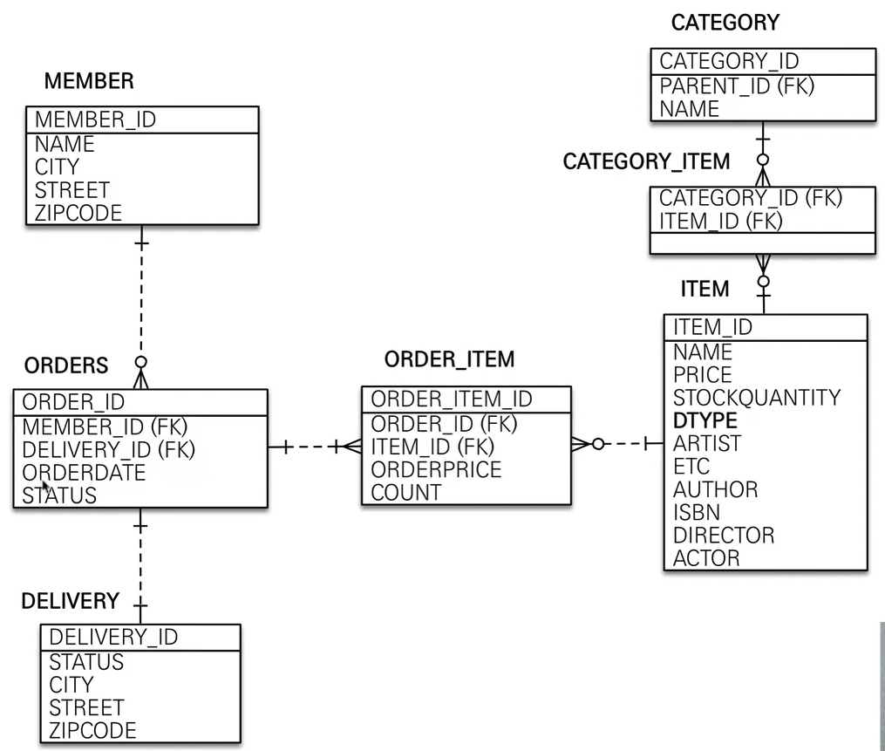

# 도메인 분 설계

## 목차
- 요구사항
- 도메인 모델과 테이블 설계
- 엔티티 클래스 개발
- 엔티티 설계시 주의점

## 요구사항 분석
기능 목록
- 회원 기능
  - 회원 등록
  - 회원 조회
- 상품 기능
  - 상품 등록
  - 상품 수정
  - 상품 조회
- 주문 기능
  - 상품 주문
  - 주문 내역 조회
  - 주문 취소
- 기타 요구사항
  - 상품은 제고 관리가 필요하다.
  - 상품의 종류는 도서, 음반, 영화가 있다.
  - 강품을 카테고리로 구분할 수 있다.
  - 상품 주문시 배송 정보를 입력할 수 있다.

## 도메인 모델과 테이블 설계

### 회원 엔티티 분석

### 회원 테이블 분석

### 연관관계 매핑 분석
* 회원과 주문 : 다대일의 양방향 관계다. 따라서 연관관걔의 주인을 정해야 하는데, 외래 키가 있는 주문을 연관관계의 주인으로 정하는것이 좋다.
그러므로 'Order.member'를 'ORDERS.MEMBER_ID' 외래 키와 매핑 한다.
* 주문상품과 주문 :
* 주문상품과 상품 :
* 주문과 배송 :
* 카테고리와 상품 :

> 외래키가 연관관걔 주인이 되어야 하는 이유   
> 만약 member가 주인이 되어 orders 목록을 삭제하거나 추가하면 실제 물리 테이블인 Order에 fk들이 다 업데이트 될것이다.
> 난 멤버만 수정했는데 오더테이블에 DDL문이 ... 
> 성능이나 유지보수면에서 좋지 않다.
> 
> 1:1 관계일때는 주로 액세스 많이 되는 쪽으로 연관관계 주인으로 선택 한다.

### 엔티티 클래스 개발
